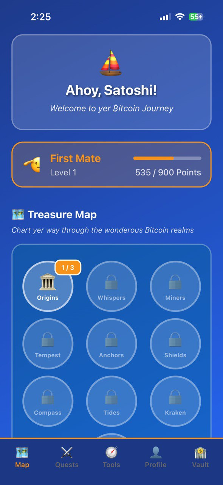

  
  
  # Odyssey: Your Bitcoin Journey Begins Here
  
  *Embark on an epic adventure to master Bitcoin and unlock the future of finance*

## 🌟 What is Odyssey?

Odyssey is a **gamified mobile app** designed to educate beginners about Bitcoin through an **adventure-themed experience**. Sail through a cosmic sea, complete quests, track prices with the Price Compass, plan investments with the DCA Treasure Planner, and engage with a community to master Bitcoin basics.

### 🎯 The Problem We Solve

Bitcoin can be intimidating for beginners. Complex terminology, volatile markets, and overwhelming technical concepts often deter newcomers from entering the crypto space. **Odyssey transforms this journey into an engaging adventure**, making Bitcoin education accessible, fun, and rewarding.

## 🌍 Why Learn About Bitcoin?

### 💰 **Financial Sovereignty**
- Take control of your money without relying on banks or governments
- Access global financial services 24/7
- Protect your wealth from inflation and economic instability

### 🌐 **Global Accessibility**
- Send money anywhere in the world instantly and cheaply
- No need for traditional banking infrastructure
- Perfect for remittances and international transactions

### 🔒 **Security & Transparency**
- Cryptographically secure transactions
- Transparent blockchain technology
- Your keys, your Bitcoin - true ownership

### 📈 **Investment Opportunity**
- Limited supply (only 21 million Bitcoin will ever exist)
- Growing institutional adoption
- Hedge against traditional financial systems

### 🚀 **Future-Proof Technology**
- Understanding the technology that's reshaping finance
- Early adoption of revolutionary monetary system
- Skills that will be valuable in the digital economy

## 🎮 How Odyssey Makes Bitcoin Learning Fun

### ⛵ **Adventure-Themed Learning**
- **Sail through a cosmic sea** of Bitcoin knowledge
- Complete **quests and challenges** to unlock new concepts
- Earn **rewards and achievements** as you progress
- Visual storytelling that makes complex topics digestible

### 🧭 **Interactive Tools**

#### 📊 **Price Compass**
- Real-time Bitcoin price tracking with beautiful visualizations
- Historical price analysis and trends
- Market sentiment indicators
- Educational explanations of price movements

#### 💎 **DCA Treasure Planner**
- Dollar-Cost Averaging calculator to plan your Bitcoin investments
- Risk assessment tools
- Portfolio optimization suggestions
- Investment timeline visualization

#### 🏆 **Community Features**
- Connect with fellow Bitcoin learners
- Share achievements and progress
- Participate in educational challenges
- Learn from experienced community members

### 📚 **Comprehensive Learning Path**
- **Beginner-friendly explanations** of Bitcoin fundamentals
- **Progressive difficulty** that grows with your knowledge
- **Real-world examples** and practical applications
- **Interactive quizzes** to test your understanding

## 🎯 Key Features

- 🎮 **Gamified Learning Experience** - Turn Bitcoin education into an adventure
- 📱 **Mobile-First Design** - Learn Bitcoin on-the-go, anywhere, anytime
- 🧭 **Price Compass** - Track Bitcoin prices with educational insights
- 💰 **DCA Treasure Planner** - Plan and optimize your Bitcoin investments
- 👥 **Community Integration** - Connect with like-minded Bitcoin enthusiasts
- 📊 **Progress Tracking** - Monitor your learning journey and achievements
- 🔔 **Smart Notifications** - Stay updated with market movements and learning reminders
- 🌙 **Dark/Light Mode** - Comfortable viewing in any environment

## 🚀 Getting Started

1. **Download Odyssey** from the App Store or Google Play
2. **Create your account** and customize your learning profile
3. **Begin your journey** with the introductory quests
4. **Track Bitcoin prices** using the Price Compass
5. **Plan your investments** with the DCA Treasure Planner
6. **Join the community** and share your progress

## 🎨 Landing Page

This repository contains the landing page for the Odyssey Bitcoin app, showcasing the app's features and benefits to potential users. The landing page features:

- **Modern, responsive design** that works on all devices
- **Interactive demonstrations** of app features
- **Compelling call-to-actions** to drive downloads
- **Educational content** about Bitcoin benefits
- **Community testimonials** and success stories

## 🛠️ Technology Stack

- **Framework**: Astro for static site generation
- **Styling**: Tailwind CSS for responsive design
- **Language**: TypeScript for type safety
- **Package Manager**: pnpm for efficient dependency management

## 📱 App Screenshots

  
  
  
  

## 🌟 Benefits of Using Odyssey

### 🎓 **Educational Excellence**
- Learn Bitcoin at your own pace
- Interactive content that sticks
- Gamified progression system
- Comprehensive curriculum covering all aspects of Bitcoin

### 💡 **Practical Application**
- Real-time market data integration
- Investment planning tools
- Risk management education
- Portfolio optimization guidance

### 👥 **Community Support**
- Connect with fellow Bitcoin learners
- Share knowledge and experiences
- Get help when you're stuck
- Celebrate achievements together

### 📈 **Investment Success**
- Make informed Bitcoin investment decisions
- Understand market cycles and trends
- Develop long-term investment strategies
- Minimize risks through education

## 🎯 Target Audience

- **Bitcoin Beginners** - Those new to cryptocurrency who want to learn
- **Investors** - People interested in Bitcoin as an investment
- **Students** - Individuals studying finance, technology, or economics
- **Professionals** - Those working in finance who need to understand Bitcoin
- **Entrepreneurs** - Business owners exploring Bitcoin integration

## 🚀 Future Roadmap

- **Advanced Trading Features** - More sophisticated investment tools
- **NFT Integration** - Learn about Bitcoin-based digital assets
- **DeFi Education** - Understanding decentralized finance
- **Enterprise Features** - Tools for business Bitcoin adoption
- **Multi-language Support** - Make Bitcoin education globally accessible

## 📞 Contact & Support

Have questions about Odyssey or Bitcoin? We're here to help!

- **Email**: odysseybtcapp@gmail.com
- **X/Twitter**: [tosinxogunjobi](https://x.com/tosinxogunjobi)

## 📄 License

This project is licensed under the MIT License - see the [LICENSE](LICENSE) file for details.

## 🙏 Credits

This landing page is built using the excellent [Mobile App Landing Template by sofiyevsr](https://github.com/sofiyevsr/mobile-app-landing-template), which provided a solid foundation for creating an effective and visually appealing landing page. We're grateful for the open-source community that makes projects like this possible.

---

  <strong>Start your Bitcoin odyssey today! 🚀</strong> 
  <em>Because everyone deserves to understand the future of money.</em>

